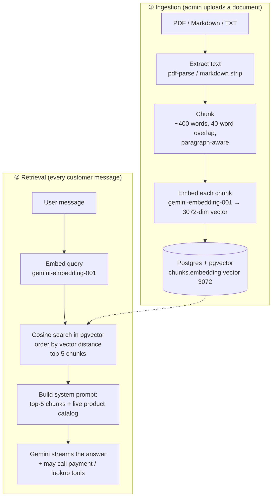

# PaySense

**An AI shop assistant that answers customer questions from your own documents and takes payment — Stripe card or M-Pesa — without ever leaving the chat window.**

🔗 **Live demo:** [paysense-seven.vercel.app](https://paysense-seven.vercel.app/) · Demo shop: **TechNairobi Electronics** (Nairobi, Kenya)

---

## What it does

- **Answers product & policy questions** grounded in your uploaded documents (RAG — Retrieval-Augmented Generation), so it never makes up answers.
- **Knows your live catalog** — products and prices managed in an admin dashboard are injected into the assistant, which treats them as authoritative.
- **Takes payment in-chat** — the model calls server-side tools to create a Stripe Checkout link or trigger an M-Pesa STK push. Prices are always recalculated server-side; the model's numbers are never trusted.
- **Looks up orders** — customers can check an order's status by its 8-character reference, mid-conversation.
- **Emails receipts** automatically when a payment completes.

---

## How the RAG pipeline works

PaySense uses a classic two-phase RAG design — **ingestion** (offline, when you upload a doc) and **retrieval** (per user message) — backed by a **pgvector** vector database.



### 1. Ingestion — documents → vectors

When an admin uploads a file at `/admin/upload` ([`api/upload/route.ts`](src/app/api/upload/route.ts)):

1. **Text extraction** — PDFs via `pdf-parse`; Markdown/TXT via a lightweight markdown stripper ([`lib/chunker.ts`](src/lib/chunker.ts)).
2. **Chunking** — text is split into ~**400-word** chunks with a **40-word overlap**, splitting on paragraph boundaries first so chunks stay semantically coherent.
3. **Embedding** — each chunk is turned into a **3072-dimension** vector with Google's `gemini-embedding-001` ([`lib/embeddings.ts`](src/lib/embeddings.ts)), in batches of 20.
4. **Storage** — chunks and their vectors are written to Postgres (see the vector-DB section below).

### 2. Retrieval — question → grounded answer

On every customer message ([`api/chat/route.ts`](src/app/api/chat/route.ts) → [`lib/rag.ts`](src/lib/rag.ts)):

1. The message is embedded with the same model.
2. A **cosine-similarity search** runs in pgvector to pull the **top-5 most relevant chunks**.
3. Those chunks **plus the live product catalog** are assembled into the system prompt.
4. Gemini streams the answer, grounded in that context, and may call tools (`create_stripe_checkout`, `mpesa_stk_push`, `lookup_order`).

This keeps answers factual (bounded by your documents) while the structured product catalog guarantees correct names, prices, and stock status.

---

## The vector database (Postgres + pgvector)

PaySense stores embeddings in **Postgres** using the [**pgvector**](https://github.com/pgvector/pgvector) extension — no separate vector store to run. (Hosted on Neon in the demo.)

- **Column type:** `chunks.embedding` is `vector(3072)`, matching the `gemini-embedding-001` output dimension.
- **Similarity:** cosine distance via pgvector's `<=>` operator; similarity is reported as `1 - (embedding <=> query)`.

  ```sql
  SELECT c.id, c.content, d.title,
         1 - (c.embedding <=> $1::vector) AS similarity
  FROM chunks c
  JOIN documents d ON c.document_id = d.id
  WHERE c.embedding IS NOT NULL
  ORDER BY c.embedding <=> $1::vector
  LIMIT 5;
  ```

- **Exact search (no ANN index):** at 3072 dimensions, pgvector's approximate indexes (HNSW / IVFFlat) aren't available — they cap at 2000 dims — so retrieval is an **exact (brute-force) scan**. That's perfectly fast at demo/SMB catalog scale. For very large corpora you'd reduce dimensionality (e.g. a 1024-dim embedding) and add an HNSW index.
- **Prisma + raw SQL:** Prisma has no native `vector` type, so the column is declared as `Unsupported("vector(3072)")?` in [`schema.prisma`](prisma/schema.prisma) (which stops `prisma db push` from dropping it) and all vector reads/writes go through `prisma.$queryRaw` / `$executeRaw`.

The extension must be enabled once per database:

```sql
CREATE EXTENSION IF NOT EXISTS vector;
```

---

## Tech stack

| Layer | Choice |
|---|---|
| Framework | Next.js 14 (App Router) + TypeScript |
| Styling | Tailwind CSS |
| AI / streaming | Vercel AI SDK v4 (`ai@4`, `@ai-sdk/google@1`) |
| LLM | `gemini-3.5-flash-lite` (Google AI Studio free tier) |
| Embeddings | Google `gemini-embedding-001` (3072-dim) |
| Database | Postgres + **pgvector** via Prisma ORM (Neon) |
| Payments | Stripe Checkout + M-Pesa Daraja STK Push |
| Email | Resend (optional) |
| Auth | NextAuth v4 (single admin) |

---

## Project structure

```
src/
  app/
    api/
      chat/route.ts            ← RAG + streaming tool calling
      upload/route.ts          ← PDF/Markdown → chunks → embeddings
      admin/products/          ← product catalog CRUD
      webhooks/stripe|mpesa/   ← payment confirmation + receipts
      orders/[id]/route.ts     ← order status polling
    admin/                     ← protected dashboard (products, knowledge base)
    chat/                      ← customer chat UI
  components/
    chat/                      ← ChatInterface, MessageBubble (+ payment widgets)
    admin/                     ← ProductManager, DocumentUpload, OrdersTable
  lib/
    rag.ts                     ← retrieval + product catalog + system prompt
    embeddings.ts              ← gemini-embedding-001 helpers
    chunker.ts                 ← PDF/Markdown → chunks
    payment-tools.ts           ← Stripe / M-Pesa tool executors
    orders.ts                  ← order reference + lookup
    email.ts                   ← Resend receipt sender
prisma/
  schema.prisma
  seed.ts                      ← seeds demo shop knowledge (embeddings)
  seed-products.ts             ← seeds the demo product catalog
```

---

## Getting started

### Prerequisites

- Node.js 20+
- A Postgres database with the `pgvector` extension (e.g. [Neon](https://neon.tech) or Supabase)
- A Google AI Studio API key (free) — for chat + embeddings
- (Optional) Stripe, M-Pesa Daraja, and Resend credentials to exercise payments/receipts

### Setup

```bash
git clone https://github.com/danmainah/paysense.git
cd paysense
npm install                 # postinstall applies the required SDK patch (see below)

cp .env.local.example .env.local   # then fill in the values below

npm run db:push             # create tables
npm run db:seed             # seed demo shop knowledge (embeds into pgvector) — needs GOOGLE_GENERATIVE_AI_API_KEY
npm run db:seed-products    # seed the 10 demo products

npm run dev                 # http://localhost:3000
```

### Environment variables (`.env.local`)

```bash
# Database (use the POOLED connection string on serverless)
DATABASE_URL=postgresql://...

# AI (chat + embeddings)
GOOGLE_GENERATIVE_AI_API_KEY=

# Auth (single admin)
NEXTAUTH_SECRET=
NEXTAUTH_URL=http://localhost:3000
ADMIN_EMAIL=admin@paysense.co
ADMIN_PASSWORD_HASH=         # base64-encoded bcrypt hash (see note below)

# App URL (used as a fallback for Stripe redirects)
NEXT_PUBLIC_APP_URL=http://localhost:3000

# Stripe
STRIPE_SECRET_KEY=
STRIPE_WEBHOOK_SECRET=

# M-Pesa (Daraja)
MPESA_ENV=sandbox
MPESA_CONSUMER_KEY=
MPESA_CONSUMER_SECRET=
MPESA_SHORTCODE=174379
MPESA_PASSKEY=
MPESA_CALLBACK_URL=https://<public-https-url>/api/webhooks/mpesa

# Email receipts (optional — no-ops if unset)
RESEND_API_KEY=
RECEIPT_FROM_EMAIL=onboarding@resend.dev
```

> `ADMIN_PASSWORD_HASH` must be **base64-encoded** (not a raw bcrypt string) because dotenv strips `$` from unquoted values. Generate with `npm run hash-password <password>`, then `node -e "console.log(Buffer.from('<hash>').toString('base64'))"`.

### Common commands

```bash
npm run dev            # dev server
npm run build          # prisma generate + next build
npm run typecheck      # tsc --noEmit
npm run lint           # eslint
npm run db:push        # push schema to DB
npm run db:seed        # seed demo knowledge (embeddings)
npm run db:seed-products
npm run db:studio      # Prisma Studio
```

---

## Running & using the app

Once `npm run dev` is up on **http://localhost:3000**:

1. **Customer chat** — open [http://localhost:3000/chat](http://localhost:3000/chat). Ask about products, prices, delivery, warranty, or say something like *"I want to buy a Samsung Galaxy A55 and pay via M-Pesa, my number is 2547XXXXXXXX."*
2. **Admin dashboard** — open [http://localhost:3000/admin](http://localhost:3000/admin) and sign in with `ADMIN_EMAIL` / the password you hashed into `ADMIN_PASSWORD_HASH`.
   - **Products** (`/admin/products`) — add/edit products; the assistant uses these instantly.
   - **Knowledge Base** (`/admin/upload`) — drop in a PDF/Markdown/TXT; it's chunked, embedded, and searchable right away (this is the RAG ingestion step).
   - **Dashboard** (`/admin`) — orders, revenue, and questions the assistant couldn't answer.

If you ran `npm run db:seed` and `npm run db:seed-products`, the demo shop already has knowledge and a 10-item catalog, so you can start chatting immediately.

### Testing payments locally

Payments call external services, so they need a bit of local wiring:

**Stripe** — forward webhooks to your local server with the [Stripe CLI](https://stripe.com/docs/stripe-cli):

```bash
stripe listen --forward-to localhost:3000/api/webhooks/stripe
# copy the "whsec_..." it prints into STRIPE_WEBHOOK_SECRET, then restart `npm run dev`
```

**M-Pesa** — the Daraja callback needs a public HTTPS URL, so tunnel with [ngrok](https://ngrok.com):

```bash
ngrok http 3000
# set MPESA_CALLBACK_URL=https://<id>.ngrok-free.app/api/webhooks/mpesa, then restart
```

Use the Safaricom sandbox test number (`254708374149`) or your own number. The chat shows the order reference and live payment status; the webhook flips the order to **completed** and sends a receipt (if `RESEND_API_KEY` is set).

---

## Deployment (Vercel)

1. Import the repo into Vercel (auto-detects Next.js).
2. Add all the env vars above, pointing `NEXTAUTH_URL`, `NEXT_PUBLIC_APP_URL`, and `MPESA_CALLBACK_URL` at your Vercel domain.
3. Deploy, then:
   - **Stripe:** add a webhook endpoint `https://<domain>/api/webhooks/stripe` (event `checkout.session.completed`) and set its signing secret as `STRIPE_WEBHOOK_SECRET`.
   - **M-Pesa:** point your Daraja callback at `https://<domain>/api/webhooks/mpesa`.

Payments derive their return URL from the live request origin, so checkout returns to whatever domain the customer is on.

---

## Implementation note: the `thought_signature` patch

`gemini-3.5-flash-lite` is a *thinking* model: it returns a `thoughtSignature` at the **part level** and requires it echoed back on step 2 of a multi-step tool call, or the API rejects the request. `@ai-sdk/google@1.2.22` doesn't handle this, so a small patch ([`patches/@ai-sdk+google+1.2.22.patch`](patches/)) bridges the signature through. It's applied automatically by the `postinstall` → `patch-package` hook — **if tool calls start 400-ing after an install, check the patch applied.**

---

## License

Private project — not currently licensed for redistribution.
